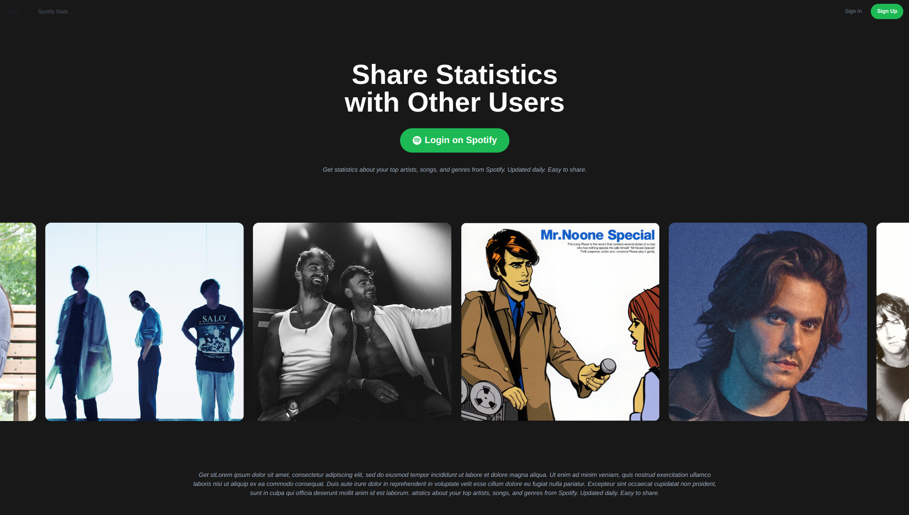
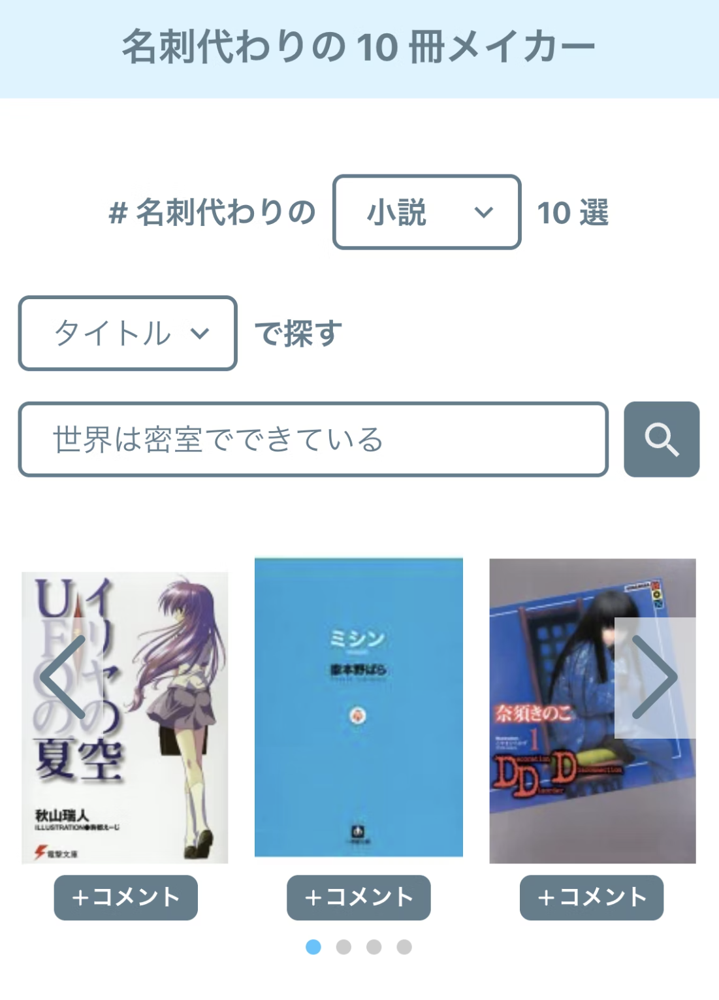
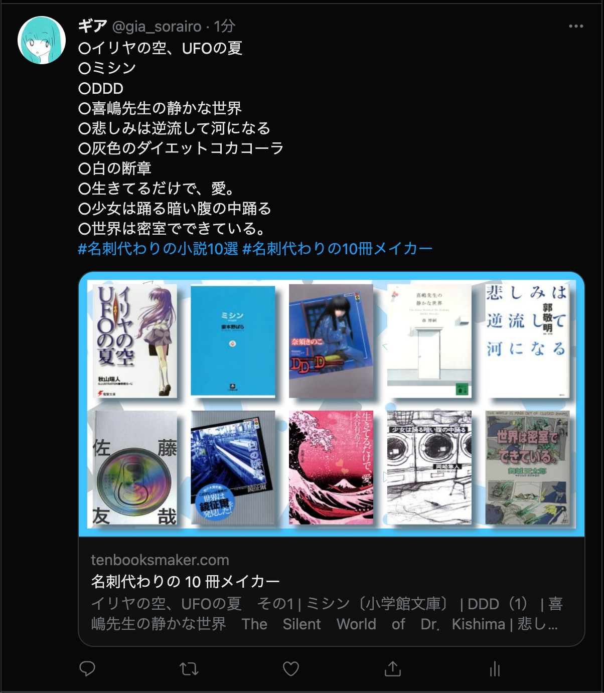

+++
title = "Spotify Stats"
outputs = ["Reveal"]
+++

# Spotify Stats
### Team Ras

---

## メンバー
- 中川
  - フロントエンド
  - バックエンド
  - デザイン
- 鍬田
  - データベース
- 加本
  - 資料作成
---

---
## 概要
---

---

## 制作の経緯

---

---

## 公式の機能の問題点
 - 年に1回しか見ることができない
 - アプリからしか見られない
 - 共有の手段に乏しい

---

## 使用技術
- TypeScript
- Next.js(React)
- Prisma
- Vercel
- PlanetScale
- Chakra UI

---

## 苦労したこと
- 開発言語の変更(PHP->TS)
- フレームワークの学習コスト
- DBの選定

--- 

ご清聴ありがとうございました.

---
