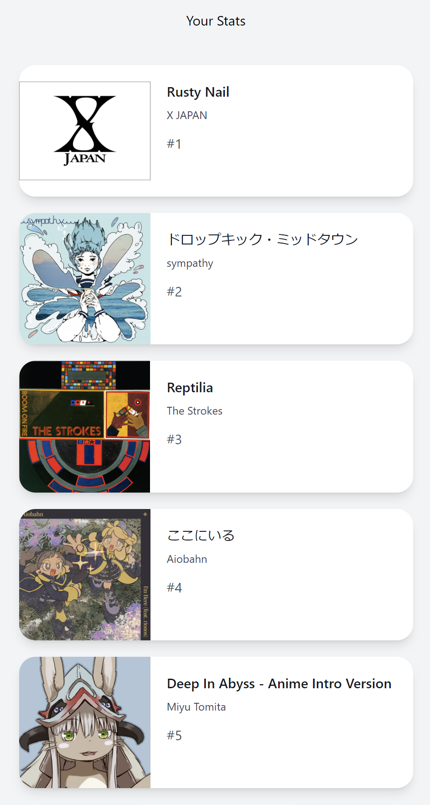
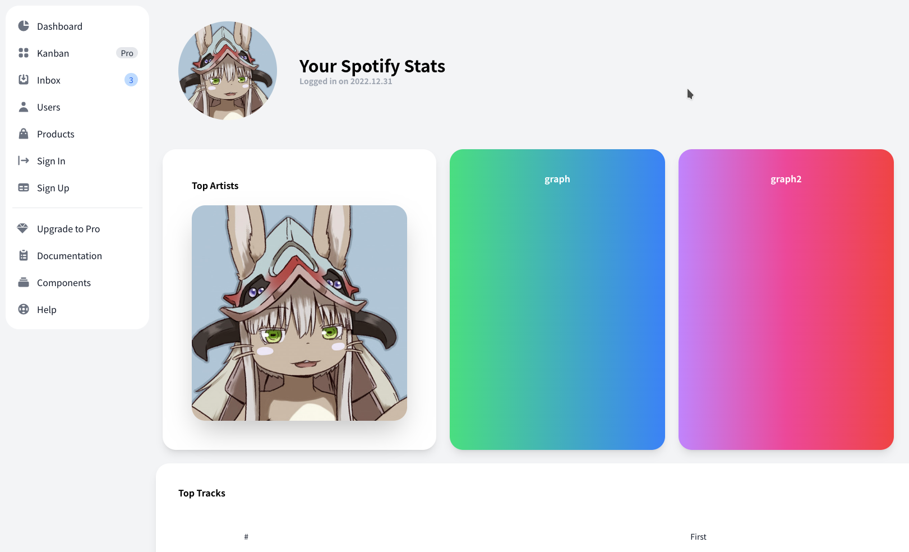

+++
title = "Spotify Stats"
outputs = ["Reveal"]
+++

# Spotify Stats
### Team Ras
---

---
## 概要

---

---

## 取得できるデータ(一部)
- 最も聴いている曲のランキング
- 最も聴いているアーティストのランキング
- 最も聴いているジャンルのランキング
- ランキング上位曲の平均BPM
- ランキング上位曲のキーの最頻値
- 曲が持つユーザー属性
- 上記データとトップチャートのデータを比較

---
## 制作の経緯

---

---

## 公式の機能の問題点
 - 年に1回しか見ることができない
 - アプリからしか見られない
 - 共有の手段に乏しい
 - 情報が多くない

---

## 使用技術
- JavaScript
- Next.js
- NextAuth.js
- Vercel
- Firebase(Firestore)
- Spotify Web API
- Tailwind CSS

---

## 苦労した点と現状の問題
- 開発言語の変更(PHP->JS)
- JSフレームワークの学習コスト
- DBの選定
- APIをパブリックで利用するためには**完成したサイト**が必要で，ユーザーはまだ利用できない

--- 

ご清聴ありがとうございました.
